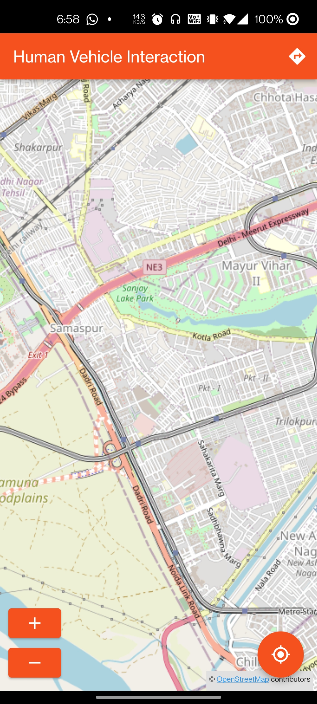
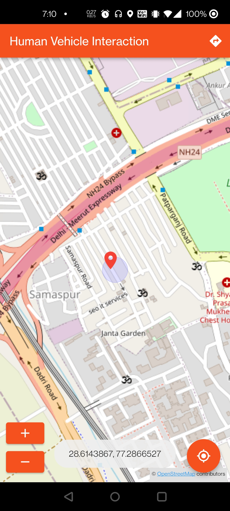
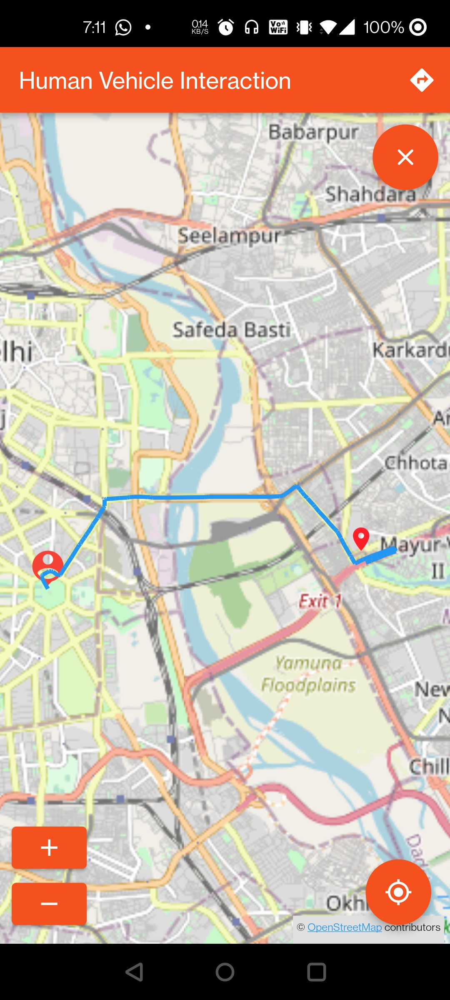
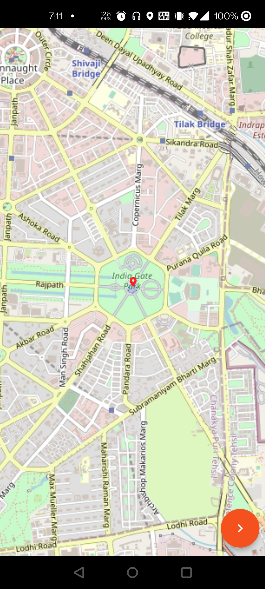
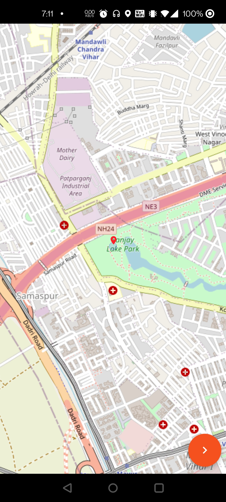
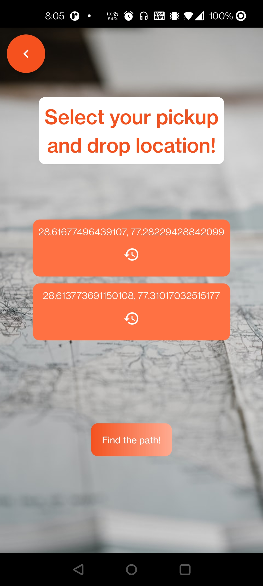

# IIITD ALIVE HVI submission

<p align="centre">
    
</p>

<div align="center">

[](https://github.com/Saransh-cpp/IIITD_ALIVE_HVI/actions/workflows/CI.yml)
    
</div>

Submission for IIITD's ALIVE lab project round 2.

## Tech stack and plugins
- `Flutter`
- `Dart`
- `Open Street Map` API
- [`flutter_osm_plugin`](https://pub.dev/packages/flutter_osm_plugin)
- [`flutter_toast`](https://pub.dev/packages/fluttertoast)
- `CI` pipeline using `GitHub Actions`

**Developer plugins**

- [`flutter_launcher_icons`](https://pub.dev/packages/flutter_launcher_icons)
- [`flutter_native_splash`](https://pub.dev/packages/flutter_native_splash)

## Features
- The application integrates the `Open Street Map` API with `Flutter`.
- A user can move the map to his location and coordinates by pressing a single button.
- A user can select 2 locations (which can be easily scaled to include more than 2 points) for the pickup and drop feature.
- A user can visualise and remove the path/road between 2 points for a car (which can be easily scaled to include other vehicle types).

## Extras
- The repository also has a [`CI`]() pipeline built using `GitHub Action` to make the development process smoother.
- The app has a native splash screen and an app icon.
- The code is modular and has no linting issue (which can be seen in the `CI`).
- The code is well commented and potential errors have been handled well.
- The UI is responsive and should work in most of the android screen sizes.

## Application overview

**Relevant files**
- [`main.dart`](https://github.com/Saransh-cpp/IIITD_ALIVE_HVI/blob/main/lib/main.dart)
- [`screens/home.dart`](https://github.com/Saransh-cpp/IIITD_ALIVE_HVI/blob/main/lib/screens/home.dart)
- [`screens/select_locations.dart`](https://github.com/Saransh-cpp/IIITD_ALIVE_HVI/blob/main/lib/screens/select_locations.dart)
- [`screens/search_location.dart`](https://github.com/Saransh-cpp/IIITD_ALIVE_HVI/blob/main/lib/screens/search_location.dart)
- [`.github/workflows/CI.yml`](https://github.com/Saransh-cpp/IIITD_ALIVE_HVI/blob/main/.github/workflows/CI.yml)
- [`README.md`](https://github.com/Saransh-cpp/IIITD_ALIVE_HVI/blob/main/README.md)

**MockUps**
<p align="centre">
    
    
</p>


**Screen Recording**

https://user-images.githubusercontent.com/74055102/148904879-c3571045-d392-47b7-8446-b345e7f39fe4.mp4

## Tasks
### Task1
Integrate any map API (say google/openstreet/mapmyindia) in an app.

**Relevant files**
- [`main.dart`](https://github.com/Saransh-cpp/IIITD_ALIVE_HVI/blob/main/lib/main.dart)
- [`home.dart`](https://github.com/Saransh-cpp/IIITD_ALIVE_HVI/blob/main/lib/screens/home.dart)

**Pipeline**
- The application opens up the integrated `Open Street Map` API on the home screen, which is launched my `main` method available in `main.dart`.
- A user can navigate anywhere on the world map.
- Finger gestures can be used to zoom in and zoom out. Additionally, 2 buttons are also provided to zoom in and zoom out.

**Screenshots**



**Screen Recording**

https://user-images.githubusercontent.com/74055102/148905081-4625900f-bf9d-4fc4-8fbc-ef481d8b617a.mp4

### Task2
Get the current location of the user and show it on the map.

**Relevant files**
- [`home.dart`](https://github.com/Saransh-cpp/IIITD_ALIVE_HVI/blob/main/lib/screens/home.dart)

**Pipeline**
- Home screen has a `FloatingActionButton` that centers the map to user's current location and displays the coordinates in the form of a toast.

**Screenshots**



**Screen Recording**

https://user-images.githubusercontent.com/74055102/148905038-42575dfe-93ca-463d-9cea-067d13867fef.mp4

### Task3
Select two different locations (Where to, where from) for the pickup and drop feature from the map.

**Relevant files**
- [`select_locations.dart`](https://github.com/Saransh-cpp/IIITD_ALIVE_HVI/blob/main/lib/screens/select_locations.dart)
- [`search_location.dart`](https://github.com/Saransh-cpp/IIITD_ALIVE_HVI/blob/main/lib/screens/search_location.dart)

**Pipeline**
- Home screen has a button available in the `AppBar` that redirects user to a new screen, from where they can select pickup and drop location.
- The new screen (`SelectLocation`) has 3 buttons, one to select the pickup location, one to select the drop location, and one to draw a path between them.
- Clicking on any of the first 2 bottons redirects the user to a map screen (`SearchLocation`) where the user can select their location by navigating to it and pressing the `FloatingActionButton`.
- The map in `SearchLocation` screen automatically takes the user to their current location after loading for a bit, but the user can also navigate to any other location before or after the current location loads (shown in the screenrecording).
- Once a location is selected, the coordinates are displayed on the `SelectLocation` screen with an option to edit the location.
- Once both the locations are selected, a user can proceed ahead to visualise a path between them.

**Screenshots**

<p float="left">
    





</p>

**Screen Recording**

https://user-images.githubusercontent.com/74055102/148905131-0dffa1b2-5827-4c88-a1bb-b7a664208f53.mp4

### Task4

**Relevant files**
- [`home.dart`](https://github.com/Saransh-cpp/IIITD_ALIVE_HVI/blob/main/lib/screens/home.dart)
- [`select_locations.dart`](https://github.com/Saransh-cpp/IIITD_ALIVE_HVI/blob/main/lib/screens/select_locations.dart)
- [`search_location.dart`](https://github.com/Saransh-cpp/IIITD_ALIVE_HVI/blob/main/lib/screens/search_location.dart)

**Pipeline**
- After clicking the "Find the path!" button in `SelectLocation` screen, the user is redirected to home screen.
- A path/road (for a car, which can be easily scaled to other vehicles) is drawn in the home screen that connects the slected pickup and drop location.
- Additionally, the distance and the approximate time taken by a car to reach the drop point is also displayed through a toast.
- When the path/road is active, a `FloatingActionButton` appears at the top-right corner of the screen which can be used to remove the path/road. The button disappears when there is no highlighted path/road.

**Screenshots**


**Screen Recording**

https://user-images.githubusercontent.com/74055102/148905131-0dffa1b2-5827-4c88-a1bb-b7a664208f53.mp4

### Task5
The code should be well documented with comments and also, create a README describing the complete pipeline.

**Relevant files**
- [`README.md`](https://github.com/Saransh-cpp/IIITD_ALIVE_HVI/blob/main/README.md)
- All the files are well commented.


## Building a release APK
**The app works with no issues in the debug mode**

The app still runs in the debug mode but can be migrated to a release build -

Adding the following lines in `android/app/src/mai/AndroidManifest.xml` -
```xml
<manifest .... >

    <uses-permission android:name="android.permission.ACCESS_COARSE_LOCATION" />
    <uses-permission android:name="android.permission.ACCESS_FINE_LOCATION"/>
    <uses-permission android:name="android.permission.INTERNET" />
    <uses-permission android:name="android.permission.ACCESS_NETWORK_STATE"  />
    <uses-permission android:name="android.permission.WRITE_EXTERNAL_STORAGE" />
    
</manifest>
```

The following lines should be removed/edited because of some limitations/bugs of `flutter_osm` (which I discovered while working on the same) -
1. Remove line 114 and lines 121-126 in `home.dart` -
```dart
      // obtain the coordinated of user
      GeoPoint coordinates = await controller.myLocation();

      // display the coordinated using a toast
      Fluttertoast.showToast(
          msg: '${coordinates.latitude}, ${coordinates.longitude}',
          toastLength: Toast.LENGTH_LONG,
          gravity: ToastGravity.CENTER,
          fontSize: 16.0
      );
```
2. Modify lines 32-34 in `home.dart` (any coordinates will work) -
```dart
controller = MapController(
      initMapWithUserPosition: false,
      initPosition: GeoPoint(
        latitude: 28.7041,
        longitude: 77.1025,
      ),
    );
```

Running -
```
flutter clean
flutter build apk --release
```

## Getting Started

This project is a starting point for a Flutter application.

A few resources to get you started if this is your first Flutter project:

- [Lab: Write your first Flutter app](https://flutter.dev/docs/get-started/codelab)
- [Cookbook: Useful Flutter samples](https://flutter.dev/docs/cookbook)

For help getting started with Flutter, view our
[online documentation](https://flutter.dev/docs), which offers tutorials,
samples, guidance on mobile development, and a full API reference.
